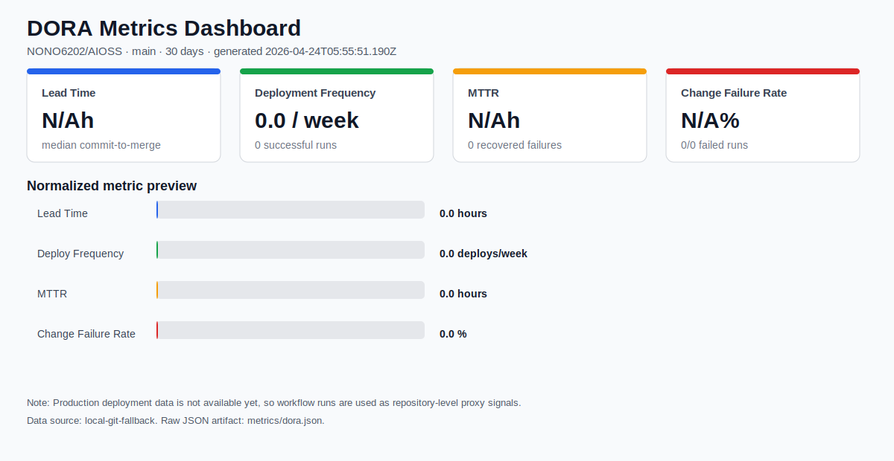
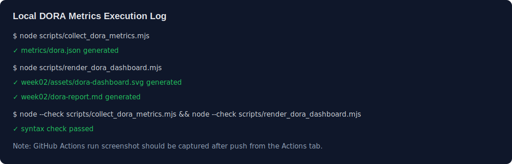

# Week 02: Metrics That Matter

[](https://github.com/NONO6202/AIOSS/actions/workflows/metrics.yml)

## 과제 내용

GitHub Actions 워크플로우로 DORA 4대 지표를 자동 수집하고, JSON 아티팩트와 대시보드 시안을 함께 제시합니다.

## 제출 파일

- [DORA Metrics workflow](../.github/workflows/metrics.yml)
- [수집 스크립트](../scripts/collect_dora_metrics.mjs)
- [대시보드 렌더링 스크립트](../scripts/render_dora_dashboard.mjs)
- [Chart.js 대시보드 시안](dashboard.html)
- [DORA 주간 보고서](dora-report.md)
- [개선안](IMPROVEMENT.md)
- [DORA JSON 샘플](../metrics/dora.json)
- [로컬 실행 로그 캡처](assets/local-execution-log.svg)

## 대시보드 미리보기



## 실행 로그

현재 로컬에서 수집/렌더링 스크립트가 정상 실행되는 것을 확인했습니다. GitHub Actions workflow는 push 후 Actions 탭에서 실행 결과를 확인할 수 있습니다.



## 수집 기준

이 저장소는 아직 운영 배포 환경이 없기 때문에 실제 production deployment 대신 GitHub 저장소 활동을 기반으로 한 프록시 지표를 사용합니다.

| 지표 | 수집 방식 |
| --- | --- |
| Lead Time | 병합된 PR의 첫 commit 시각부터 merge 시각까지의 중앙값 |
| Deployment Frequency | 기본 브랜치에서 성공한 workflow run 수를 주 단위로 환산 |
| MTTR | 실패한 workflow run 이후 같은 workflow/branch에서 다음 성공 run까지 걸린 평균 시간 |
| Change Failure Rate | 완료된 workflow run 중 실패/취소/타임아웃 비율 |

## 사용 API 및 도구

| 구분 | 사용 항목 | 용도 |
| --- | --- | --- |
| GitHub REST API | Pull Requests API | 병합된 PR과 commit 시각을 조회해 Lead Time 계산 |
| GitHub REST API | Workflow Runs API | workflow 성공/실패 이력을 조회해 배포 빈도, MTTR, Change Failure Rate 계산 |
| GitHub Actions | `.github/workflows/metrics.yml` | 지표 수집, 보고서 생성, artifact 업로드 자동화 |
| Node.js | `scripts/collect_dora_metrics.mjs` | GitHub API와 local git fallback 기반 지표 수집 |
| Node.js | `scripts/render_dora_dashboard.mjs` | JSON 결과를 Markdown 보고서와 SVG 대시보드로 변환 |
| Chart.js | `week02/dashboard.html` | 브라우저에서 확인 가능한 대시보드 시안 |

## 실행 방법

```bash
node scripts/collect_dora_metrics.mjs
node scripts/render_dora_dashboard.mjs
```

GitHub Actions에서는 매주 월요일 00:00 UTC, 수동 실행, 관련 파일 변경 push 시 자동 실행됩니다. 실행 결과는 `dora-metrics` artifact로 저장됩니다.

## 생성형 AI 활용

본 문서와 자동화 스크립트 작성 및 정리 과정에는 생성형 AI를 활용했습니다. 최종 내용은 직접 검토하고 수정했습니다.
